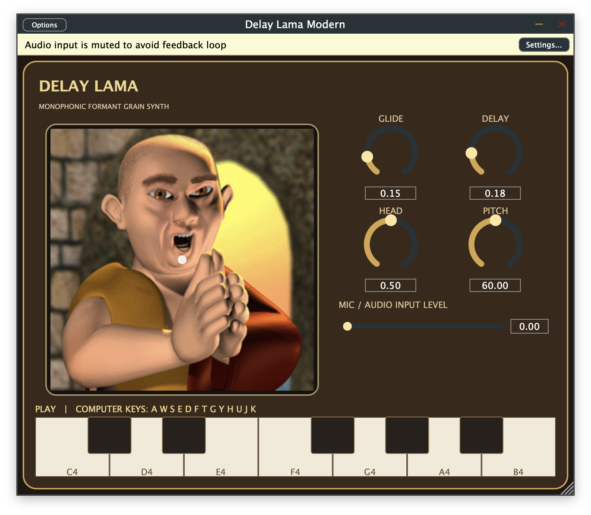

# Delay Lama Modern

An unofficial, non-commercial macOS reimplementation prototype inspired by the archived Delay Lama instrument. It recreates the documented controls and recovered formant-grain approach, using the original recovered face artwork. It is a new approximation, not the original plug-in binary, and is not affiliated with or endorsed by the original creators.



## Install on an Apple Silicon Mac

Prebuilt AU, VST3, and standalone app bundles are in [`release/macOS-arm64`](release/macOS-arm64/). The same bundles are packaged in [`Delay-Lama-Modern-macOS-arm64.zip`](release/Delay-Lama-Modern-macOS-arm64.zip).

- Copy `AU/Delay Lama Modern.component` to `~/Library/Audio/Plug-Ins/Components/` for Logic, GarageBand, and other AU hosts.
- Copy `VST3/Delay Lama Modern.vst3` to `~/Library/Audio/Plug-Ins/VST3/` for VST3 hosts such as Ableton Live, Cubase, and Reaper.
- Reopen or rescan plug-ins in your DAW. The standalone app is in `Standalone/`.

These builds target Apple Silicon (`arm64`). They are unsigned local builds; macOS may require you to approve opening them.

## Playing and recording in a DAW

Add Delay Lama Modern to an instrument track and record-enable the track. When you play a MIDI controller, the DAW records the incoming MIDI notes in its clip and sends them to the plug-in; playback sends those notes to the instrument again. The plug-in also has a clickable C4–B4 keyboard and computer-keyboard mapping (`A W S E D F T G Y H U J K`). Those keys play the sound internally, so the DAW does not record them as MIDI clips; record the track’s audio output if you want to capture that performance.

The plug-in accepts an optional mono/stereo audio input and applies its vowel formant filters to that signal. In standalone, click **Settings…** to select and enable an input device, then raise **Mic / Audio Input Level**. Standalone audio input starts muted to avoid feedback. In a DAW, enable the plug-in’s audio input bus if the host exposes it, and allow microphone access for the DAW if macOS requests it. The mic path changes the formant color but does not pitch-shift the live voice; MIDI notes play the synthesized voice.

## Controls and implementation

- XY pad: pitch and continuous vowel morphing.
- MIDI: monophonic notes, pitch bend to vowel, CC1 vibrato, CC5 glide, CC7 level, CC12 delay, CC13 head size.
- Synth: three vowel-dependent formant curves interpolated across the five recovered vowel waypoints, with a newly written FOF-like overlapping grain voice.
- Audio input: three resonant filters follow the same vowel formant profile.

The sound engine is based on approximate static decompilation and needs listening-based tuning. MIDI timing and several controller details also need further refinement. The extracted original small knob/handle PICTs are kept in `Assets/Original-PICT`; larger recovered graphics are converted and embedded in the plug-in.

## Build from source

Requires CMake, Xcode command-line tools, and network access for CMake to fetch JUCE 8.0.9.

```sh
cmake -S . -B build -DCMAKE_BUILD_TYPE=Release -DJUCE_BUILD_EXAMPLES=OFF -DJUCE_BUILD_EXTRAS=OFF
cmake --build build --config Release --target DelayLamaModern_AU DelayLamaModern_VST3 DelayLamaModern_Standalone
```

JUCE is dual-licensed under AGPLv3 or a commercial licence. See [JUCE’s license](https://github.com/juce-framework/JUCE/blob/8.0.9/LICENSE.md) before distributing modified source or binaries.

## Status

This is a personal, non-commercial hobby project shared as-is, with no warranty. It is an independent reimplementation and is not affiliated with, endorsed by, or sold on behalf of the original Delay Lama's creators. The extracted original PICT resources under `Assets/Original-PICT` are included for preservation and reference alongside this reimplementation.
